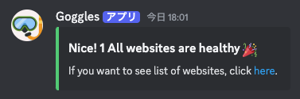

# 🥽 Goggles

OSINT 問題の想定解で使用する、Web サイトの死活監視を行うツール。一般的な Web 問題でも使用することができます。

<div id="image-table" align="center">
  <table>
    <tr>
      <td style="padding:10px;border:none;">
        
      </td>
      <td style="padding:10px;border:none;">
        
      </td>
    </tr>
  </table>
</div>

## How to use

### 1. Setup

スプレッドシートを作成し、「websites」シートに以下のような形式で Web サイトの情報を記入します。


次に、「config」シートに以下のような形式で設定を記入します。


適切に監視対象の URL や Webhook URL、期間やメンションを設定した後、Apps Script に dist/index.js を設定します。dist/index.js は以下のコマンドで生成できます。

```bash
yarn && yarn build
```

その後、Triggers をこのように設定します。


### 2. Add a website

新しい Web サイトを監視する場合は、「websites」シートに新しい行を追加します。

A 列に URL を、B 列にその URL へアクセスして Status 200 が返ってきたときに表示されて欲しい文字列(例: flag)を記入します。B 列に指定する文字列は改行区切りで複数を OR 指定することができます。もし And 条件で指定したい場合は、列を 2 つ作成することで対応できます。
